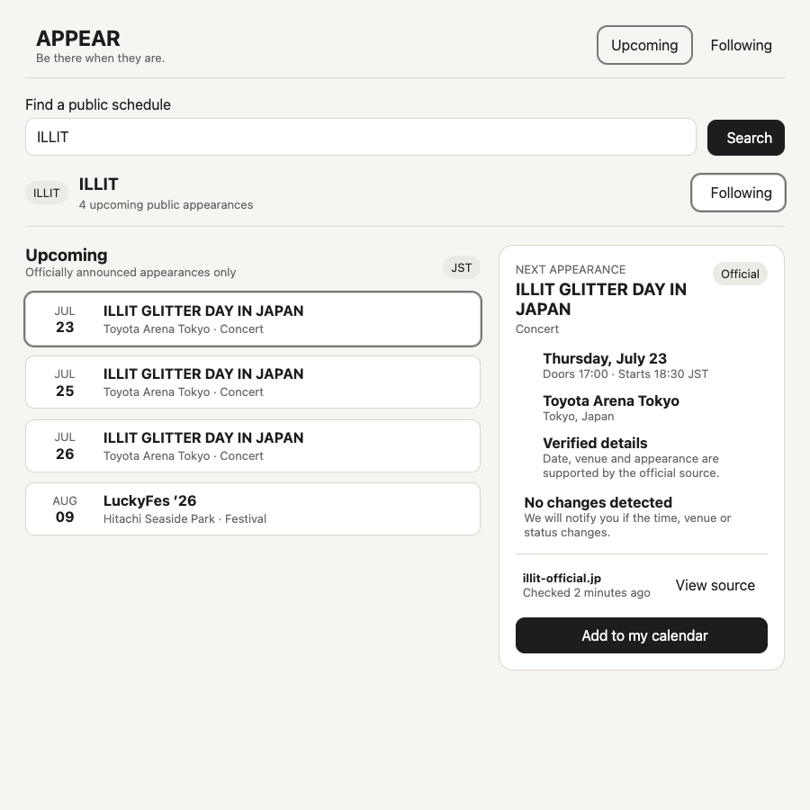
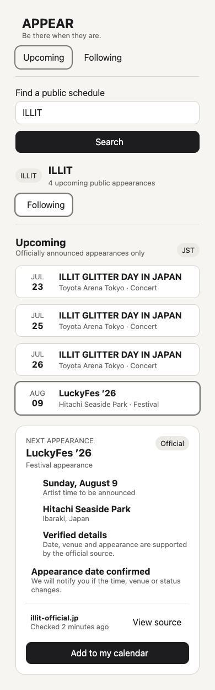

# APPEAR — build prompt

Build a polished hackathon MVP in this empty repo. Do not ask questions; follow this spec exactly.

## Stack and limits

- Next.js App Router + React + TypeScript, npm, plain CSS, Vitest + React Testing Library.
- Use server routes for secrets and Kimi calls. Use fixture source text; no scraping or web-search implementation. No auth, database, maps, social features, recommendations, UI kit, or unnecessary packages.
- Generate `.ics` files without a library. Persist follow/refresh state in `localStorage`.

## Visual target




Match their hierarchy and editorial black/cream styling. At ≥768px show the event list left and selected event right; below 768px stack them. Support 320px without horizontal overflow. Use accessible native controls and visible focus states.

Visual tokens: cream `#f6f5f1` background, ink `#1d1d1f`, white cards, warm-gray `#d8d5cc` borders, muted `#686868`, system sans-serif. Use 10px control and 16px card radii, thin borders, generous whitespace, no gradients, decorative shadows, or artist imagery. The search bar is dominant; only the selected-event panel is a card.

## Required flow

1. Header: **APPEAR** / “Be there when they are.”
2. Search is case-insensitive and trims whitespace. `ILLIT` opens its schedule.
3. Unknown names show `We don’t track “{name}” yet.` and **Find their schedule**. Clicking it simulates `Searching trusted sources…`, then creates a pending watch: `No verified schedule found. We’ll keep watching.`
4. Show ILLIT appearances chronologically; selecting one updates the detail panel.
5. Detail shows date, JST time, venue, type, verification, source, change status, and **Add to my calendar**.
6. Follow/unfollow works and persists.
7. Show `Checked {relative time}` and **Refresh**. Relative time updates every minute. Auto-refresh every 15 minutes while open; manual refresh has a 60-second cooldown.
8. Refresh states: `Checking…` → `Updated just now` or `No changes`; failure retains existing events and shows retry. The first refresh changes July 23 start time from 18:00 to 18:30; later refreshes return unchanged. Never reset `lastCheckedAt` merely by rendering.

## Fixture

| Date (2026, JST) | Event | Venue | Time |
|---|---|---|---|
| Jul 23 | ILLIT GLITTER DAY IN JAPAN | Toyota Arena Tokyo | doors 17:00, start 18:00 → 18:30 after refresh |
| Jul 25 | same | Toyota Arena Tokyo | doors 16:00, start 17:30 |
| Jul 26 | same | Toyota Arena Tokyo | doors 15:00, start 16:30 |
| Aug 9 | LuckyFes ’26 | Hitachi Seaside Park, Ibaraki | TBA |

Sources: `https://illit-official.jp/schedule/448882bcd3c1` and `https://illit-official.jp/schedule/a67dbfc0afb0`. Display links, but do not fetch them or copy their media.

Use this boundary so a permitted server source can replace the fixture later:

```ts
type Appearance = {
  id: string;
  title: string;
  type: string | null;
  start: string | null;
  doors: string | null;
  venue: string | null;
  location: string | null;
  status: "scheduled" | "cancelled";
  sourceUrl: string;
};
type RefreshState = "idle" | "checking" | "failed";
type RefreshResult = { events: Appearance[]; changed: boolean; message: string };

interface ScheduleAdapter {
  load(personId: string): Promise<Appearance[]>;
  refresh(personId: string): Promise<RefreshResult>;
}
```

## Kimi agent

Use **Kimi through ai& inference** to extract and normalize public appearances from supplied source text. Kimi does not perform web search in this MVP. Keep the key server-only and call Kimi from `POST /api/refresh`; never call ai& from a client component.

Create `.env.example`:

```env
AIAND_API_KEY=
AIAND_BASE_URL=https://api.aiand.com/v1
AIAND_MODEL=moonshotai/kimi-k2.7-code
```

Install `openai` and use the OpenAI-compatible Chat Completions API:

```ts
import OpenAI from "openai";

const client = new OpenAI({
  apiKey: process.env.AIAND_API_KEY,
  baseURL: process.env.AIAND_BASE_URL,
  maxRetries: 2,
  timeout: 20_000,
});

const result = await client.chat.completions.create({
  model: process.env.AIAND_MODEL!,
  temperature: 0,
  response_format: { type: "json_object" },
  messages: [
    { role: "system", content: "Extract only explicitly announced public appearances. Never infer missing facts. Return JSON: {events:[{title,type,start,doors,venue,location,status,sourceUrl}]}. Use ISO 8601 with timezone; use null for unknown values." },
    { role: "user", content: sourceText },
  ],
});
```

`POST /api/refresh` accepts `{ "personId": "illit" }`, loads the refreshed fixture text, calls Kimi, validates `result.choices[0].message.content`, creates deterministic IDs, diffs events, and returns `RefreshResult`. Missing key → `503 AI_NOT_CONFIGURED`; invalid/provider output → `502 INFERENCE_FAILED`. Preserve cached events on errors. Never log keys or full responses.

Manual provider smoke test (never run in automated tests):

```bash
curl https://api.aiand.com/v1/chat/completions \
  -H "Authorization: Bearer $AIAND_API_KEY" \
  -H "Content-Type: application/json" \
  -d '{"model":"moonshotai/kimi-k2.7-code","messages":[{"role":"user","content":"Reply with OK"}]}'
```

Docs: `https://docs.aiand.com/api/chat-completions/`.

## Parallel work plan

The coordinator first scaffolds the project, installs dependencies, and creates `Appearance`, `RefreshResult`, and `ScheduleAdapter` in `src/contracts/**`. Then run three subagents concurrently with exclusive ownership:

| Agent | Owns | Deliverable |
|---|---|---|
| UI | `src/app/page.tsx`, `src/app/layout.tsx`, `src/app/globals.css`, `src/components/**`, UI tests | Responsive reference-matched UI, search states, selection, following, timers, refresh interaction |
| Domain | `src/domain/**`, domain tests | Fixtures, sorting/diffing, adapter, persistence helpers, relative time, `.ics` generation |
| Kimi | `src/server/**`, `src/app/api/refresh/**`, `.env.example`, route tests | ai& client, prompt, validation, refresh route, typed errors |

Only the coordinator edits `package.json`, lockfiles, configs, or `src/contracts/**`. Colocate tests inside each agent’s owned paths. Agents must request contract changes rather than edit outside their ownership. After all finish, the coordinator wires modules together, runs full verification, and resolves integration failures.

## Tests

Write deterministic tests (fake timers where needed) proving:

1. **Domain:** `  illit  ` resolves to ILLIT; events sort chronologically; `.ics` contains valid calendar boundaries and event details.
2. **UI:** selecting LuckyFes updates all details; unknown search completes the pending-watch flow; follow state survives remount.
3. **UI:** relative time advances; auto-refresh fires at 15 minutes, not before.
4. **UI:** manual refresh shows checking, applies the time change, updates `lastCheckedAt`, enforces cooldown, and preserves events on failure.
5. **Kimi:** the route uses the required model/JSON mode, validates output, and maps missing-key, invalid-JSON, and provider errors. Mock Kimi; never call the live API in tests.

## Done when

- `npm test -- --run` and `npm run build` pass with no warnings or console errors.
- All required flows work by keyboard and match both reference images closely.
- Loading, empty, error, changed, and unchanged states are visible and tested.
- Source attribution and last-checked status are always visible for a selected event.
- A real refresh uses Kimi when `AIAND_API_KEY` is present, while the key is absent from client bundles and logs.
